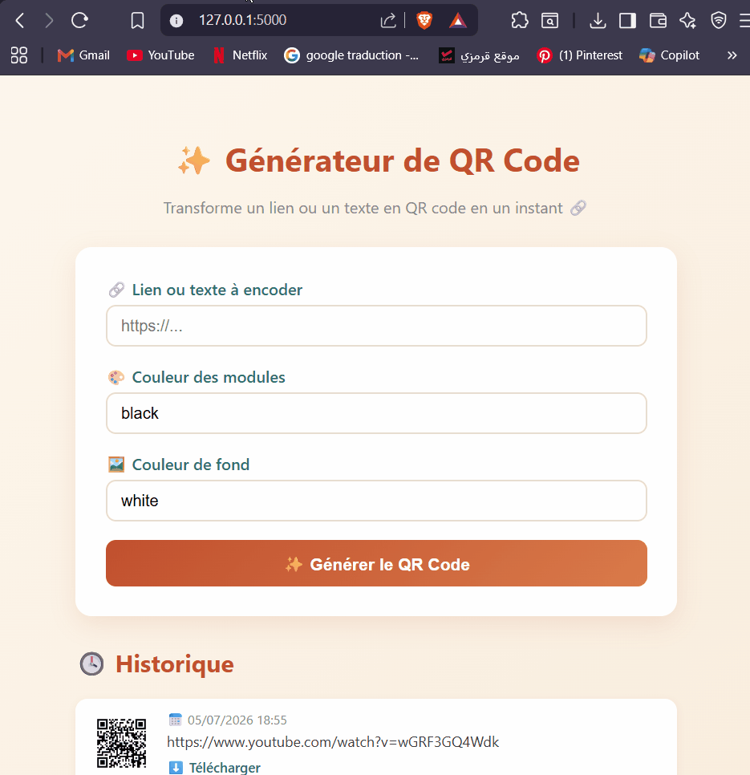

# ✨ QR Code Generator — Flask

A simple and elegant web application to generate customizable QR codes from any link or text, built with **Flask** and the **qrcode** Python library.

## Features

- 🔗 Generate a QR code from any link or text
- 🎨 Customize module and background colors
- 📥 Download generated QR codes as PNG images
- 🕓 View a history of previously generated QR codes
- 💾 Persistent history stored in a local JSON file
## 📸 Démo

<p align="center">
  
</p>


## Tech Stack

- **Backend:** Python, Flask
- **QR Code generation:** [qrcode](https://pypi.org/project/qrcode/) + Pillow
- **Frontend:** HTML, CSS, Jinja2 templates

## Installation

1. Clone the repository
```bash
   git clone https://github.com/mellouliyasmine20/qr-code-generator-flask.git
   cd qr-code-generator-flask
```

2. Create and activate a virtual environment
```bash
   python -m venv venv
   venv\Scripts\activate   # Windows
```

3. Install dependencies
```bash
   pip install -r requirements.txt
```

4. Run the app
```bash
   python app.py
```

5. Open your browser at `http://127.0.0.1:5000/`

## Project Structure
qr-code-generator-flask/
├── app.py
├── requirements.txt
├── static/
│   └── qrcodes/
├── templates/
│   └── index.html
└── history.json

## Author

**Yasmina Mellouli**  
Full-stack developer & UI/UX designer